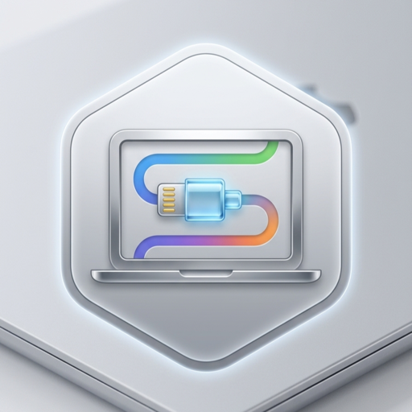

<div align="center">
  

  # MCP DocStore

  **A multi-tenant [Model Context Protocol](https://modelcontextprotocol.io) server for persistent documents — so AI agents can save, find, and edit work that survives across sessions and tools.**

  [](LICENSE)
</div>

---

## What it is

MCP DocStore gives AI agents a shared, durable place to keep documents. An agent in one
session (say, a Claude.ai artifact) writes a document; an agent in another (say, Claude Code)
retrieves and edits it later. Documents live in **projects**, each document carries a short
**overview** for quick scanning plus a longer markdown **body**, and every edit is versioned
so nothing is lost.

It is its own **OAuth 2.1 authorization server**: it federates login to your existing identity
provider (Okta, or any OIDC IdP), mints its own audience-bound access tokens, and resolves each
caller to a **tenant** by email domain or address. Data is isolated per tenant, with org-wide,
private, and shared projects. Connecting an MCP client is paste-a-URL — no per-client OAuth app
to register on your IdP.

## Features

- **Projects & documents** — `org` (whole-tenant) or `private` projects; documents with
  overview + markdown body + tags.
- **Sharing** — share a project with individual users (by email) or with groups drawn from
  the token's `groups` claim; read or write.
- **Versioned edits** — full-replace, section (markdown heading) edits, append, and section
  delete. Mutating edits use optimistic concurrency (`base_version`); every edit snapshots the
  prior version. Inspect history with `list_snapshots` / `get_snapshot` / `diff_versions` and
  roll back with `restore_snapshot`.
- **Full-text search** — keyword search (powered by [Bleve](https://github.com/blevesearch/bleve))
  scoped to exactly what the caller may see; no query syntax to learn.
- **Archiving** — archive/unarchive projects to hide them from lists and search while keeping
  them reachable by id.
- **Safe destructive ops** — `delete_project`, `delete_document`, and `restore_snapshot` are
  confirmation-guarded via MCP **elicitation** (with a `confirm: true` fallback for clients
  that can't prompt).
- **Multi-tenant & config-seeded** — tenants and their admins are declared in config; a user
  belongs to exactly one tenant.

## Tool surface

| Group | Tools |
|---|---|
| Projects | `list_projects`, `create_project`, `get_project`, `update_project`, `archive_project`, `unarchive_project`, `delete_project` |
| Sharing | `share_project`, `unshare_project`, `list_project_shares` |
| Documents | `list_documents`, `create_document`, `get_document`, `get_section`, `edit_document`, `append_document`, `delete_section`, `delete_document` |
| History | `list_snapshots`, `get_snapshot`, `diff_versions`, `restore_snapshot` |
| Search | `search_documents` |

Each tool is annotated with read-only / destructive / closed-world hints so clients can reason
about safety.

## Configuration

Copy [`config.example.yaml`](config.example.yaml) and edit it:

```yaml
listen_addr: ":8080"
public_url: "https://docs.example.com"   # public base URL; used in protected-resource metadata, WWW-Authenticate, and icon URLs
snapshot_retention: 10
bleve_index_path: "./data/index.bleve"

database:
  driver: sqlite                          # sqlite | mysql | postgres
  dsn: "file:./data/docstore.db?_pragma=foreign_keys(1)"

oidc:                                     # the UPSTREAM identity provider (login federation only)
  issuer: "https://idp.example.com"
  client_id: "docstore-upstream-client-id"
  client_secret: "docstore-upstream-client-secret"

oauth:                                    # the embedded OAuth 2.1 authorization server (always on)
  registration: "open"                    # "open" (default) | "allowlist"

tenants:
  - key: acme
    name: "Acme Corp"
    match:
      domains: ["acme.com", "acme.io"]
      emails: ["contractor@gmail.com"]
    admins: ["alice@acme.com"]            # tenant admins (declarative; reconciled at login)
```

Tenant admins have full read/write over every project in their own tenant. The `admins` list
is the single source of truth and is reconciled on each login.

## Running

```sh
# build
go build -o mcp-docstore .

# serve (Streamable HTTP MCP endpoint at "/mcp", metadata at /.well-known/oauth-protected-resource)
./mcp-docstore --config config.yaml

# rebuild the search index from the database (after a schema change or index loss)
./mcp-docstore --config config.yaml rebuild-index
```

> **Breaking change:** the MCP endpoint moved from `/` to `/mcp` in v0.5.0. Existing MCP clients must repoint their server URL to `<public_url>/mcp`.

On first boot with an empty index, the server builds it from the database automatically.

### Docker

Images are published to GHCR for `linux/amd64` and `linux/arm64`: `ghcr.io/fishwaldo/mcp-docstore` (tags `:X.Y.Z`, `:X.Y`, `:latest`).

Persistent state — the SQLite database and the Bleve index — lives in the container at **`/data`** (a declared volume, owned by the non-root runtime user `65532`). Point your config there and mount a volume so data survives restarts:

```yaml
# config.yaml (paths under the mounted /data volume)
bleve_index_path: "/data/index.bleve"
database:
  driver: sqlite
  dsn: "file:/data/docstore.db?_pragma=foreign_keys(1)"
```

```sh
docker run -p 8080:8080 \
  -v mcp-docstore-data:/data \
  -v "$PWD/config.yaml:/etc/mcp-docstore/config.yaml:ro" \
  ghcr.io/fishwaldo/mcp-docstore --config /etc/mcp-docstore/config.yaml

# rebuild the index in the same container/volume
docker run --rm \
  -v mcp-docstore-data:/data \
  -v "$PWD/config.yaml:/etc/mcp-docstore/config.yaml:ro" \
  ghcr.io/fishwaldo/mcp-docstore --config /etc/mcp-docstore/config.yaml rebuild-index
```

Notes:
- The container runs as **non-root (uid 65532)**. A Docker **named volume** (as above) is initialized with the right ownership automatically. If you use a **bind mount** instead (`-v $PWD/data:/data`), `chown 65532:65532` the host directory first, or the server can't write to it.
- With an external **MySQL/Postgres** backend, `/data` holds only the Bleve index (rebuildable via `rebuild-index`), not your documents.

Build it yourself:

```sh
docker build -t mcp-docstore .
```

### Authentication

MCP DocStore is its own **OAuth 2.1 authorization server** (built on
[mcp-oauth](https://github.com/giantswarm/mcp-oauth)): it federates login to your upstream IdP
(the `oidc:` block) and mints its own short-lived, audience-bound access tokens for `/mcp`. It
serves the full OAuth surface itself — `/oauth/{authorize,callback,token,revoke,register}` plus
`/.well-known/{oauth-authorization-server,openid-configuration,oauth-protected-resource,jwks.json}`
— so clients discover everything from the MCP URL alone; there is no separate Okta app per
client.

#### For users — connect an MCP client

No client registration, no client ID/secret to obtain. Just point your client at the server:

- **claude.ai** (custom connector): paste `{public_url}/mcp` as the connector URL. Dynamic
  client registration (RFC 7591) and PKCE handle the rest.
- **Claude Code**:
  ```sh
  claude mcp add --transport http docstore https://docs.example.com/mcp
  ```
  No `--client-id`, `--client-secret`, or `--callback-port` flags — open dynamic registration
  plus RFC 8252 loopback redirects handle it.

The first time a given client connects, DocStore shows a one-time **consent screen** ("`<client
name>` wants to sign you in through this server's identity provider") before forwarding to your
upstream IdP login. Approval is remembered (cookie-based, ~90 days); the first-party web UI is
exempt and never shows it.

#### For operators — deploy

You need **exactly one** confidential OIDC client registered on your upstream IdP (e.g. one Okta
app), with a single redirect URI:

```
{public_url}/oauth/callback
```

That one upstream client is shared by every downstream MCP client and the web UI — none of them
talk to the IdP directly. No API Access Management / custom-authorization-server product is
required on the IdP side; DocStore issues its own tokens.

Grant the upstream app the **`offline_access`** scope (it is in the default `oidc.scopes`). The
IdP only returns a refresh token when this scope is granted, and DocStore needs that upstream
refresh token to renew its cached provider token as sessions rotate. Without it, refreshes fail
once the cached provider token lapses and clients are forced back through full login.

```yaml
oidc:
  issuer: "https://idp.example.com"
  client_id: "docstore-upstream-client-id"
  client_secret: "docstore-upstream-client-secret"
  # allow_private_ip: true       # only for an internal IdP resolving to an RFC-1918/loopback address
  # root_ca: "/etc/mcp-docstore/idp-ca.pem"   # PEM for an internal CA signing the IdP's certificate

oauth:
  registration: "open"           # "open" (default, any client may register) | "allowlist"
  # registration_allowlist:      # required (>=1 https:// entry) when registration is "allowlist"
  #   - "https://client.example.com/callback"
```

`oauth.registration: allowlist` confines dynamic client registration to an exact-match list of
HTTPS redirect URIs — use it to restrict which third-party clients may ever register, instead of
leaving registration open to anyone who can reach the server.

Every request to `/mcp` carries `Authorization: Bearer <token>`; the server verifies its own
signature (no network call to the IdP on this path), `exp`, `iss`, and `aud`, resolves the email
to a tenant, and rejects unknown identities with `401` plus a `WWW-Authenticate` challenge
pointing at the [RFC 9728](https://datatracker.ietf.org/doc/rfc9728) protected-resource metadata.

**Rotating signing keys.** Signing keys are generated automatically on first boot and stored
(alongside a master secret used to derive at-rest encryption and cookie-signing keys) in the
`oauth_keys` database row. To rotate, delete that row and restart the server: it regenerates
fresh key material immediately. This is a disruptive operational event — **every outstanding
access and refresh token is invalidated**, and every MCP client and web UI user must re-login.

> **Breaking change (upgrading from the resource-server version):** DocStore is no longer a pure
> OAuth resource server — it now issues its own tokens. Removed config keys: `oidc.audience`
> (the server fails fast at startup with a migration message if this is still set),
> `oidc.email_claim`, `oidc.groups_claim`, `oidc.email_verified_policy`, `oidc.discovery_url`, and
> the entire per-client web block (`web.client_id`, `web.client_secret`, `web.redirect_url`,
> `web.post_logout_redirect_url`, `web.scopes`). Replace your old two-app Okta setup (one MCP
> resource-server app, one web app) with the single upstream `oidc.client_id`/`client_secret`
> client described above, plus the new `oauth:` block. Existing MCP clients and web UI sessions
> must re-authenticate once against the new flow; there is no way to carry over a resource-server
> bearer token.

### Web UI (optional, BFF)

A browser-facing session layer can be enabled by adding a `web:` block to the config. It serves
the single-page app at `/`, the login/callback/logout flow at `/auth/*`, and the read-only REST
API at `/api/*`. The web UI is a **first-party client of the embedded authorization server**,
auto-seeded from server-derived key material on boot — it needs no OAuth client credentials or
redirect URL of its own, only session cookie/timeout knobs:

```yaml
web:
  cookie_secure: true           # set false only for local HTTP dev
  idle_timeout: 24h
  absolute_timeout: 168h
  sweep_interval: 1h
```

When `web:` is absent the server is MCP-only: `/mcp` (plus the OAuth/discovery routes) is the
active surface and `/` returns 404.

## Architecture

Layered, with each package owning one job:

| Package | Responsibility |
|---|---|
| `internal/config` | Viper config load + validation |
| `internal/tenant` | email/domain → tenant resolution + admin lookup |
| `internal/auth` | token verification (local self-issued JWTs + upstream OIDC), identity resolution (SDK `TokenVerifier`) |
| `internal/oauthsrv` | embedded OAuth 2.1 authorization server: signing keys, upstream federation, consent gate, route mounting |
| `internal/ent` | generated [ent](https://entgo.io) data layer |
| `internal/store` | repository: the access rule, tenant scoping, optimistic concurrency, snapshots |
| `internal/docs` | goldmark markdown section editing + diffs |
| `internal/search` | Bleve index: build, query, rebuild |
| `internal/index` | the only bridge between `store` and `search` (keeps the index in sync) |
| `internal/mcp` | MCP tool definitions + thin handlers + elicitation |
| `cmd/server` | boot, HTTP wiring, CLI |

Built on the [Go MCP SDK](https://github.com/modelcontextprotocol/go-sdk).

## Development

```sh
go test ./...                                                          # full suite (uses in-memory SQLite)
go test -race ./internal/mcp/... ./cmd/... ./internal/oauthsrv/...     # race detector on the concurrent paths
go generate ./...                                                      # regenerate ent after a schema change
```

## License

[MIT](LICENSE) © 2026 Justin Hammond. Dependencies are permissively licensed (MIT / BSD / Apache-2.0).
